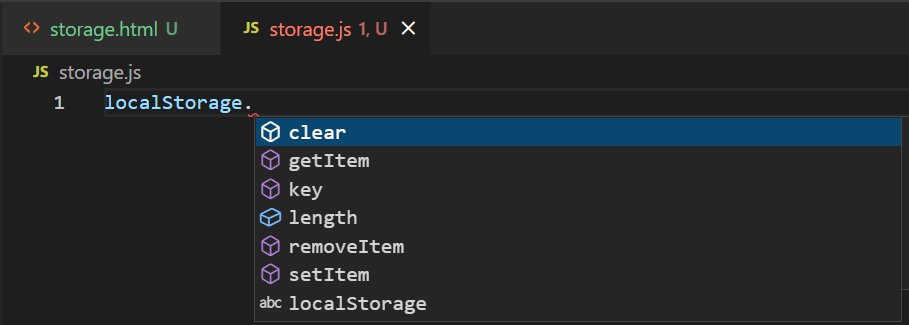
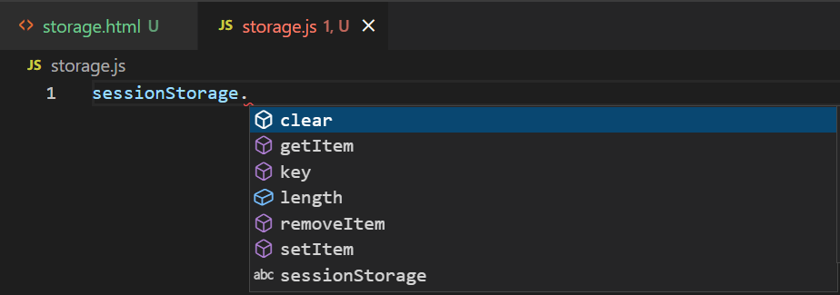

# Javascript Concepts For React


## `SUMMARY.js`

```javascript

Fundamentals
1.1 variable(let, const)
    types of variable

1.2 condition (<, >, ==, ===, <=, >=), && , || , if-else, else-if

1.3 array: declare, length, index, push, pop, indexOf, includes

1.4 for loop, while loop

1.5 function return parameter

1.6 Object property declare, access property


--------------------------------
ES6:
1. template string ${}

2. spread operator (...)
2.1 copy an array then add a new element to an array
2.2 use filter to remove an element from an array

3. Arrow function
3.1 no parameter ()
3.2 single parameter
3.3 multiple parameters ()
3.4 multiline {

}

4. Destructuring : Object , Array

5. Object shorthand

6. function  parameter default value

7. Optional chaining ?. 


--------------------------------
Browser API
1. local storage and sessin storage
2. location api
3. history api
4. fetch


--------------------------------
Others
1. array: map, forEach, filter, find
2. ternary operator
3. logical and (&&) , logical or (||) 
4. JSON(stringify, parse)


```


###  Fundamentals

```javascript

// 1. how to declare a variable using let and const
const fatherName = 'S Ahmed';
let season = 'rainy';
season = 'winter';


// 2. basic conditions: >, <, ==, ===, <=, >=,
// multiple conditions: &&, || 

if(fatherName === 'S Ahmed' || season === 'rainy'){

}
else {

}


// 3. array 
// declare
// index 
// length 
// push 
// pop 

const numbers = [20,30,40,10];
numbers[0] = 21;


// 4. loop 
// for loop
for(let i=0; i<numbers.length;i++){
    const number = numbers[i];
    console.log(number);

}


// 5. function 

function mul(num1,num2){
    const result = num1* num2;
    return result;
}

const output = mul(10,20);
console.log(output);


// 6. Object
// Three ways to access property by name  

const student = {
    name: 'Faisal',
    age: 26,
    skill: ['react','node','express','mongodb']
}

const myAge = 'age';

console.log(student.age);     // direct by property
console.log(student['age']);  // access via property name string
console.log(student[myAge]);  // access via property name in a variable


```


### ES6

```javascript
//1. template string 

const numbers = [40,30,20,70];

const student = {
    name: 'Faisal',
    age: 26,
    skills: ['react','node', 'express', 'mongodb']
}

const about = `My name is ${student.name} and age of ${student.age} and my marks is ${numbers[2]} and has skills on ${student.skills[0]} `;
console.log('Template string:',about);


// 2. arrow function 
const getFifty = () => 55;
console.log(getFifty());

const sixtyFive = num => num + getFifty();
console.log(sixtyFive(10));

const isEven = x => x%2 == 0;
console.log(isEven(4));

const addThree = (x,y,z) => x+y+z;
console.log('add Three',addThree(3,4,3));

// for multiline 
const doMath = (num1,num2) => {
    const sum = num1+num2;
    return sum;
}
console.log('do Math',doMath(10,20));


// 3. spread operator (cope an array)
// array reference type er 
// 

const newNumbers = numbers;  // problem without spread operator
numbers.push(99);
console.log(numbers);  // change both numbers and newNumbers
console.log(newNumbers);  // // change both numbers and newNumbers


const myNewNumbers = [...numbers];
numbers.push(100);
console.log(numbers);
console.log(myNewNumbers);


// create a new number from an older array and add an element
const olderNumber = [10,20,30,40];
const anotherNewNumber = [...olderNumber, 55];
console.log('olderNumber',olderNumber);
console.log('another new Number',anotherNewNumber);
```


### Array-Methods

```javascript
// 1. map 
// map return kore array er moddhe dise.

const products = [
    {name:'laptop',price:32000, brand: 'lenovo',color:'silver'},
    {name:'phone',price:7000, brand: 'iphone',color:'golden'},
    {name:'watch',price:3000, brand: 'casio',color:'yellow'},
    {name:'sunglass',price:300, brand: 'raybay',color:'black'},
    {name:'camera',price:9000, brand: 'canon',color:'gray'}
    
]

const brands = products.map(product => product.brand );
console.log(brands);

const prices = products.map(product => product.price);
console.log(prices);


// 2. forEach 
// return kora na lagle, forEach use korte hobe. 
// Jehetu return kore na, tai forEach er age kono variable rakhao lage na.


products.forEach(product => console.log(product));
products.forEach(product => console.log(product.color));

products.forEach(product => {

})

// map vs forEach 
// map = return kore 
// forEach = kono kisu return kore na


//3. filter 
// filter ekta array return kore.

const cheap = products.filter(product => product.price <= 5000);
console.log(cheap);

// j sob  product er namer moddhe 'n' ase, tader show koro.
const specificName = products.filter(product => product.name.includes('n'));
console.log(specificName);


// 4.find 
const special = products.find(product => product.name.includes('n'));
console.log(special);


// filter vs find 

// filter = condition er moddhe jara jara meet kore, filter tader sobai k dibe.
//  Jehetu sobai k dey, tai filter array return kore.

// find = condition er moddhe jeta first e meet kore, find shudu seta k dibe. 
// Jehetu ekta dey, tai find array return kore na.


```


### Destructuring

```javascript
// 1. array destructuring
const numbers = [42,55];
// const x = numbers[0];
// const y = numbers[1];

const [x,y] = [42,55];
// const [x,y] = numbers;

console.log('x: ' +x , ' y: ', +y);


function boxify (num1, num2) {
    const nums = [num1,num2];
    return nums;
}
console.log(boxify(90,34));


// const [first,second] = [90,34];
const [first,second] = boxify(90,34);
console.log(first,second);


const student = {
    name: 'Faisal',
    age: 26,
    skills: ['react','node']
}

const [firstSkill,secondSkill] = student.skills;


// 1. object destructuring
const {name, age} = {name: 'Faisal', age: 26}
console.log(name,age);

// object er khetre serial matter kore na.
// kintu array er khetre serial matter kore.

const {mySalary, myAge} = {name: 'Faisal',mySalary:35000, myAge: 26}
console.log(mySalary,myAge);


const employee = {
    yourName: 'Shajib',
    age: 26,
    machine: 'asus',
    language: ['javascript', 'c', 'python'],
    specification: {
        height: 65,
        weight: 55,
        address: 'Ontaria',
        drink: 'water'
    }
}

const {yourName, machine} = employee;
const {weight, address} = employee?.specification;
const [firstLang, secondLang, thirdLang] = employee.language;

console.log(yourName, machine, weight, firstLang);
```


### `Fetch`, `Array Loop`, `Object Loop`...


```javascript
//1. JSON (stringify, parse)

const student = {
    name: 'Faisal',
    age: 26,
    skills: ["react", 'node', 'express', 'mongodb']
}

const studentJSON = JSON.stringify(student);
console.log(student);
console.log(studentJSON);

const studentObject = JSON.parse(studentJSON);
console.log(studentObject);


// 2. fetch 

// *** fetch example, ei 3 line comment na korle error asbe.
// fetch('url')
//     .then(res => res.json())
//     .then(data => console.log(data));


//3. keys , values 
const keys = Object.keys(student);
const values = Object.values(student);


// 4. Array loop 
// array te loop calanor jonno forEach use korbo, jodi amra kono kisu return na kori,
const numbers = [20, 35, 55, 65, 25];
numbers.forEach(number => console.log(number));

// return pete caile map korbo 
numbers.map(num=> num*2);


// array like object - arguments, getElementById , querySelectorAll, ..........
// tokhn (for of) use korbo


// 5. Object loop 
// R object er jonno  (for in) use korbo


// add or remove from an array
const products = [
    {name:'laptop',price:32000, brand: 'lenovo',color:'silver'},
    {name:'phone',price:7000, brand: 'iphone',color:'golden'},
    {name:'watch',price:3000, brand: 'casio',color:'yellow'},
    {name:'sunglass',price:300, brand: 'raybay',color:'black'},
    {name:'camera',price:9000, brand: 'canon',color:'gray'}
    
]   // eita ekta array of objects 

const newProduct = {name: 'webcame', price: 700, brand: 'canon' };


// copy products array and then add newProduct
const newProducts = [...products, newProduct];
console.log(newProducts);


// create a new array without one specific item 
// remove phone means create a new array without the phone
const remaining = products.filter(product => product.name !== 'phone');
console.log("remaining array without phone: ",remaining);


```


### `Truthy` `Falsy` `Ternary Operator` `Number/String Conversion` `Toggle`

```javascript
// truthy value:
// 'Faisal', 5, true, {} , []
// empty array and empty object are also truthy values

// falsy value: 5ta
// '' , 0, false, null , undefined


// check truthy
// let  myVar = 'Faisal'; 
// let  myVar = 5; 
// let  myVar = true; 
// let  myVar = {}; 
// let  myVar = []; 

let myVar = 5;
if(myVar){
    myVar = myVar;
}
else {
    myVar = 0;
}
console.log(myVar);


// check negative/ falsy value 
let myMoney = 50;
if(!myMoney){

}


// If else  
const money = 50;
let food;
if(money >100){
    food = 'biriyani';
}
else {
    food = 'cha-biscuit';
}


// ternary operator 
const myFood = money > 100 ? 'biriyani' : 'cha-biscuit';
console.log(myFood);


// ternary operator
let taka = 100;
let distanceKiloMeter = 10; 
let go = (taka > 50 && distanceKiloMeter < 20) ? 'shopping' : 'sleeping';
console.log(go);


 
// number to string conversion
let num1 = 52;
console.log(num1);
console.log(typeof num1);
let numString = num1 + '';
console.log(numString);
console.log(typeof numString);

//  string to number  conversion
const num2 = '55';
const inputNumber = +num2;
console.log(num2);
console.log(typeof num2);
console.log(inputNumber);
console.log(typeof inputNumber);


 

// ternary operator diye function o check kora jay 
let isActive =true;
const showUser = () => console.log('display the  User');
const hideUser = () => console.log('hide the User');


isActive ? showUser() : hideUser() ;


// use && if the left side is true then right side will be executed
isActive && showUser();


// toggle boolean
isActive = !isActive;

```


### `Local Storage` `Session Storage`


<p align='center'>
  
  
  
</p>


- local/session storage e, primitive type er data k normally rakha jay
- Kintu non-primitive like array , object k rakhar jonno JSON.stringify kore rakha lage.
- Abar sei JSON data k pete caile JSON.parse korte hobe.
- For better understanding, provide an example below:

`This Code is written in console of browser`
```javascript

const pen = { price: 10, color: 'black' };
localStorage.setItem('pen',JSON.stringify(pen))
const ShowPen = localStorage.getItem('pen')
const result = JSON.parse(ShowPen)
result


```


```javascript
<!DOCTYPE html>
<html lang="en">
<head>
    <meta charset="UTF-8">
    <meta http-equiv="X-UA-Compatible" content="IE=edge">
    <meta name="viewport" content="width=device-width, initial-scale=1.0">
    <title>Storage</title>
</head>
<body>
    <h2>Local Storage and Session Storage</h2>

    <input type="text" placeholder="Storage id" id="storage-id">
    <br>
    <input type="text" placeholder="Storage value" id="storage-value">
    <br>
    <button onclick="addToLocalStorage()">Add to Local Storage</button>

    <script src="storage.js"></script>

</body>
</html>
```


```javascript
function addToLocalStorage() {
    const idInput = document.getElementById('storage-id');
    const id = idInput.value;


    const valueInput = document.getElementById('storage-value');
    const value = valueInput.value;

    // local storage setItem
    if (id && value) {
        localStorage.setItem(id, value);
    }
    idInput.value = '';
    valueInput.value = '';

}
```


